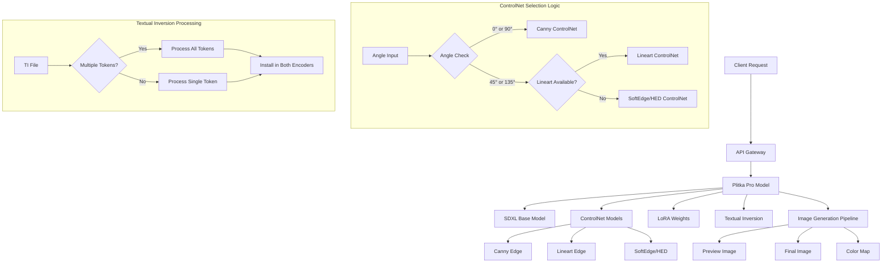

# Plitka Pro - Архитектурная Документация

## Обзор Проекта

**Plitka Pro** - это MLOps-система для генерации фотorealistic изображений резиновой плитки с использованием Stable Diffusion XL (SDXL) + ControlNet + LoRA + Textual Inversion.

## Архитектурная Диаграмма



## Ключевые Компоненты

### 1. SDXL Pipeline
- **Base Model**: `stabilityai/stable-diffusion-xl-base-1.0`
- **Refiner**: `stabilityai/stable-diffusion-xl-refiner-1.0`
- **Architecture**: Dual-encoder (CLIP-L + CLIP-G) + UNet + VAE

### 2. ControlNet Models
- **Canny**: `lllyasviel/control_v11p_sd15_canny` (для 0°/90°)
- **Lineart**: `lllyasviel/control_v11p_sd15_lineart` (для 45°/135°, приоритет)
- **SoftEdge/HED**: `lllyasviel/control_v11p_sd15_softedge` (fallback для 45°/135°)

### 3. LoRA Weights
- **Path**: `/weights/ohwx_rubber_tile_lora.safetensors`
- **Integration**: Автоматическая загрузка в pipeline

### 4. Textual Inversion
- **Path**: `/weights/ohwx_rubber_tile_ti.safetensors`
- **Format**: SDXL dual-encoder (clip_g + clip_l)
- **Processing**: Автоматическое определение количества токенов
- **Fallback**: Ручная установка при ошибках стандартного загрузчика

## API Контракт

### Входные Параметры
```json
{
  "params_json": "string" // JSON с бизнес-параметрами
}
```

### Структура params_json
```json
{
  "colors": [
    {"r": 255, "g": 0, "b": 0},
    {"r": 0, "g": 255, "b": 0}
  ],
  "angle": 45,
  "seed": 42,
  "quality": "preview|standard|high",
  "overrides": {
    "guidance_scale": 7.5,
    "num_inference_steps_preview": 16,
    "num_inference_steps_final": 30,
    "negative_prompt": "custom negative prompt"
  }
}
```

### Выходные Файлы
- `preview.png` - Быстрая превью версия (512x512)
- `final.png` - Финальное качественное изображение (1024x1024)
- `colormap.png` - Карта цветов для отладки

## Матрица Угол → ControlNet

| Угол | ControlNet | Приоритет |
|------|------------|-----------|
| 0°   | Canny      | Основной  |
| 90°  | Canny      | Основной  |
| 45°  | Lineart    | Основной  |
| 135° | Lineart    | Основной  |
| 45°  | SoftEdge   | Fallback  |
| 135° | SoftEdge   | Fallback  |

## Стратегия Сборки

### "Thin by Default"
- **Принцип**: Минимальный размер образа, модели загружаются в runtime
- **Преимущества**: 
  - Быстрая сборка
  - Экономия дискового пространства
  - Гибкость в обновлении моделей
- **Реализация**: Удалены все `build.run` команды из `cog.yaml`

### Runtime Model Loading
```python
# Автоматический fallback: локальный кэш → Hugging Face
if os.path.exists(local_path):
    model = load_from_local(local_path)
else:
    model = load_from_hf(repo_id)
```

## Производительность

### Оптимизации
- **VAE Slicing**: Включено для экономии VRAM
- **VAE Tiling**: Включено для больших изображений
- **Torch Compile**: Автоматически для Torch 2.4+
- **CUDA Optimizations**: Специфичные для GPU настройки

### Профили Качества
- **Preview**: 16/24 steps, 512x512/1024x1024
- **Standard**: 20/30 steps, 512x512/1024x1024  
- **High**: 24/40 steps, 512x512/1024x1024

## Развертывание

### Replicate
- **Registry**: `r8.im/nauslava/plitka-pro`
- **Versioning**: Git-based с тегами
- **Latest**: `nauslava/plitka-pro`
- **Specific**: `nauslava/plitka-pro@<version_id>`

### Локальная Разработка
```bash
# Сборка
cog build

# Локальный тест
cog predict -i params_json='{"colors":[...], "angle":45}'

# Публикация
cog push r8.im/nauslava/plitka-pro:v4.1.2
```

## Мониторинг и Отладка

### Логирование
- **Setup**: Время инициализации моделей
- **Generation**: Время генерации preview/final
- **Errors**: Детальные сообщения об ошибках

### Метрики
- **TTFB**: Time To First Byte
- **Generation Time**: Preview + Final
- **Memory Usage**: VRAM consumption

## Известные Проблемы и Решения

### Textual Inversion Issues
- **Проблема**: SDXL dual-encoder TI не поддерживается стандартным загрузчиком
- **Решение**: Fallback на ручную установку с автоматическим определением токенов
- **Статус**: ✅ Исправлено в v4.1.2

### ControlNet Selection
- **Проблема**: Gated модели недоступны в build-time
- **Решение**: Runtime загрузка с fallback на доступные модели
- **Статус**: ✅ Реализовано

### Build Optimization
- **Проблема**: Большой размер образа (>150GB)
- **Решение**: "Thin by default" стратегия
- **Статус**: ✅ Оптимизировано

## Планы Развития

### Краткосрочные
- [ ] Мониторинг производительности в production
- [ ] A/B тестирование различных ControlNet комбинаций
- [ ] Оптимизация prompt engineering

### Долгосрочные
- [ ] Поддержка batch processing
- [ ] Интеграция с внешними системами
- [ ] Расширение на другие типы плитки


